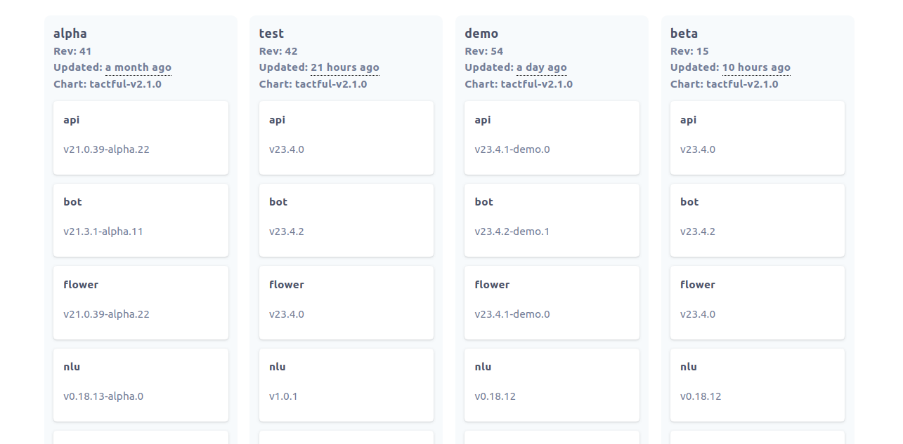

# Robban



# What is Robban?

**Robban** means **Ship Captain** in Arabic. Robban helps you manage individual deployments in your Helm releases. It makes managing distibuted deployments a breeze.

# How does it work?

Robban uses a simple declarative YAML file to allow you to describe the Helm releases you manage and the application images inside them [example yaml file](https://github.com/Praqma/helmsman/blob/master/examples/example.yaml).

Robban scans your cluster for helm releases and using JSONPath it disects the images that are deployed there. then it draws a kanban board allowing you to visually see what is deployed where.

You can also promote images accross release as you prefer using simple drag&drop between columns (releases).

# Based on helmsman

Robban is forked and is based on helmsman. and when it promotes an image it utilizes helmsman plans.

# Install

## From binary

Please make sure the following are installed prior to using `Robban` as a binary (the docker image contains all of them):

- [kubectl](https://github.com/kubernetes/kubectl)
- [helm](https://github.com/helm/helm) (helm >=v3.0.0)
- [helm-diff](https://github.com/databus23/helm-diff) (`helmsman` >= 1.6.0)

If you use private helm repos, you will need either `helm-gcs` or `helm-s3` plugin or you can use basic auth to authenticate to your repos. See the [docs](https://github.com/Praqma/helmsman/blob/master/docs/how_to/helm_repos) for details.


Check the [releases page](https://github.com/Praqma/Helmsman/releases) for the different versions.
```
# on Linux
curl -L https://github.com/Praqma/helmsman/releases/download/v3.4.2/helmsman_3.4.2_linux_amd64.tar.gz | tar zx
# on MacOS
curl -L https://github.com/Praqma/helmsman/releases/download/v3.4.2/helmsman_3.4.2_darwin_amd64.tar.gz | tar zx

mv helmsman /usr/local/bin/helmsman
```

## As a docker image
Check the images on [dockerhub](https://hub.docker.com/r/praqma/helmsman/tags/)

## As a package
Helmsman has been packaged in Archlinux under `helmsman-bin` for the latest binary release, and `helmsman-git` for master.

# Documentation

> Documentation for Helmsman v1.x can be found at: https://github.com/Praqma/helmsman/tree/1.x/docs

- [How-Tos](https://github.com/Praqma/helmsman/blob/master/docs/how_to/).

- [Desired state specification](https://github.com/Praqma/helmsman/blob/master/docs/desired_state_specification.md).

- [CMD reference](https://github.com/Praqma/helmsman/blob/master/docs/cmd_reference.md)


## Usage

Helmsman can be used in three different settings:

- [As a binary with a hosted cluster](https://github.com/Praqma/helmsman/blob/master/docs/how_to/settings).
- [As a docker image in a CI system or local machine](https://github.com/Praqma/helmsman/blob/master/docs/how_to/deployments/ci.md) Always use a tagged docker image from [dockerhub](https://hub.docker.com/r/praqma/helmsman/) as the `latest` image can (at times) be unstable.
- [As a docker image inside a k8s cluster](https://github.com/Praqma/helmsman/blob/master/docs/how_to/deployments/inside_k8s.md)


# Contributing

Pull requests, feedback/feature requests are welcome. Please check our [contribution guide](CONTRIBUTION.md).
